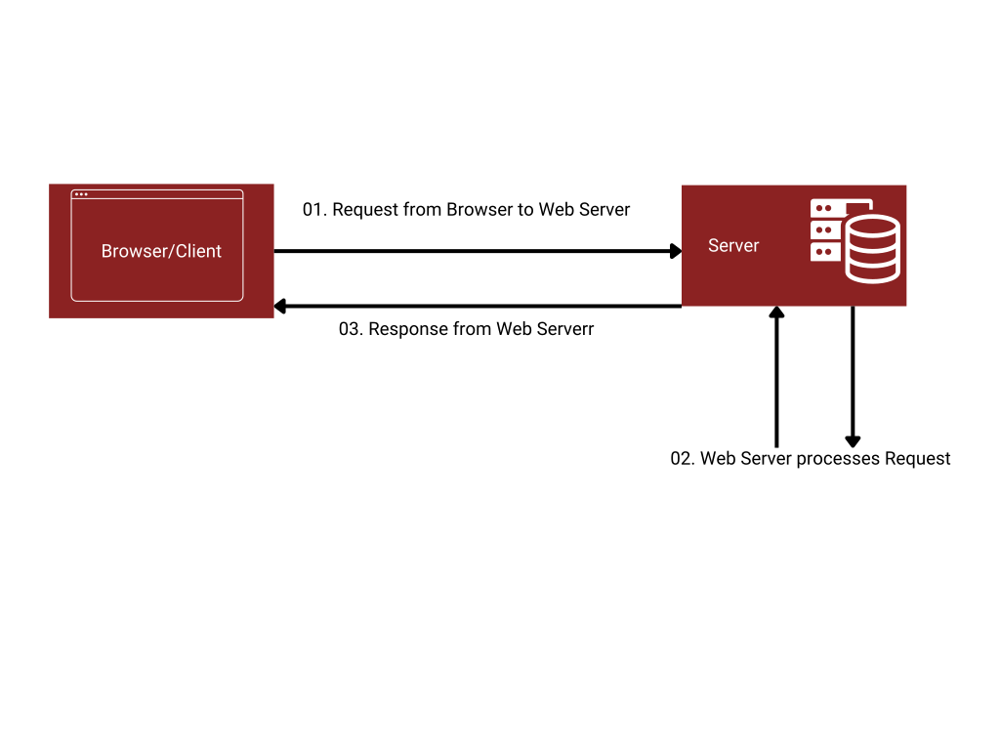
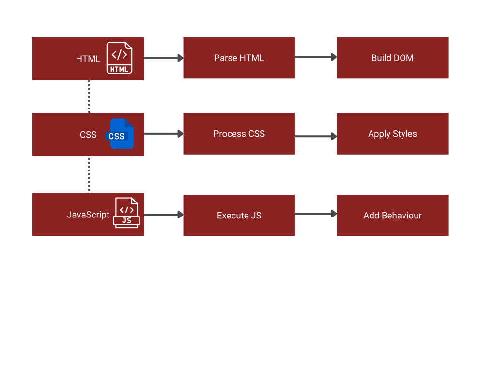

<div class="tutorial-container">

# Understanding Web Development Basics

Before diving into coding, let's understand how websites work and the technologies that power them.

<div class="highlight-box">
In this lesson, you'll learn:

- How websites work
- The client-server model
- Core web technologies
- How browsers interpret code
</div>

## How Websites Work

When you visit a website, several things happen:



1. **Request**: Your browser requests a webpage from a server
2. **Processing**: The server processes the request
3. **Response**: The server sends back HTML, CSS, and JavaScript files
4. **Rendering**: Your browser displays the webpage

<div class="highlight-box">
Think of it like ordering from a restaurant:
- You (the browser) request a meal (webpage)
- The kitchen (server) prepares it
- The waiter (internet) delivers it
- You receive and enjoy the meal (rendered page)
</div>

## Core Web Technologies

The three main technologies that power the web work together like this:


### HTML (Structure)

- The backbone of web pages
- Defines content structure
- Like the skeleton of a building

```html
<h1>Welcome</h1>
<p>This is a paragraph.</p>
```

### CSS (Style)

- Controls appearance
- Handles layout and design
- Like paint and decorations

```css
h1 {
	color: var(--primary-dark-red);
	font-size: 24px;
}
```

### JavaScript (Behavior)

- Adds interactivity
- Handles user actions
- Like the electrical system

```javascript
button.addEventListener('click', () => {
	alert('Hello!');
});
```

## The Client-Server Model

### Client (Frontend)

- Web browser
- Displays content
- Handles user interaction
- Runs on user's device

### Server (Backend)

- Stores website files
- Processes requests
- Manages data
- Runs on remote computer

<div class="highlight-box">
**Local Development**: When developing, your computer acts as both client and server:

- VS Code edits the files
- Live Server acts as your web server
- Chrome displays the results
</div>

## How Browsers Work

Browsers process web pages in several steps:



1. **Parse HTML**

   - Read HTML code
   - Create Document Object Model (DOM)

2. **Process CSS**

   - Apply styles
   - Calculate layouts

3. **Execute JavaScript**

   - Run scripts
   - Add interactivity

4. **Render Page**
   - Display final result
   - Update as needed

## Try It Yourself

1. **View Page Source**

   - Visit any website
   - Right-click > View Page Source
   - Observe HTML structure

2. **Inspect Elements**

   - Right-click > Inspect
   - Try modifying text
   - Watch changes live

3. **Network Tab**
   - Open DevTools
   - Go to Network tab
   - Reload page
   - Watch resources load

<div class="highlight-box">
Practice Exercise:

1. Create a simple HTML file
2. View it in Chrome
3. Use DevTools to inspect it
4. Watch the Network tab as it loads
</div>

## Common Terms

- **URL**: Web page address
- **Domain**: Website name (e.g., google.com)
- **HTTP**: Protocol for web communication
- **DNS**: System that converts domains to IP addresses
- **Hosting**: Service that stores website files

## What's Next?

Now that you understand how websites work, let's dive deeper into using VS Code for web development.

</div>
