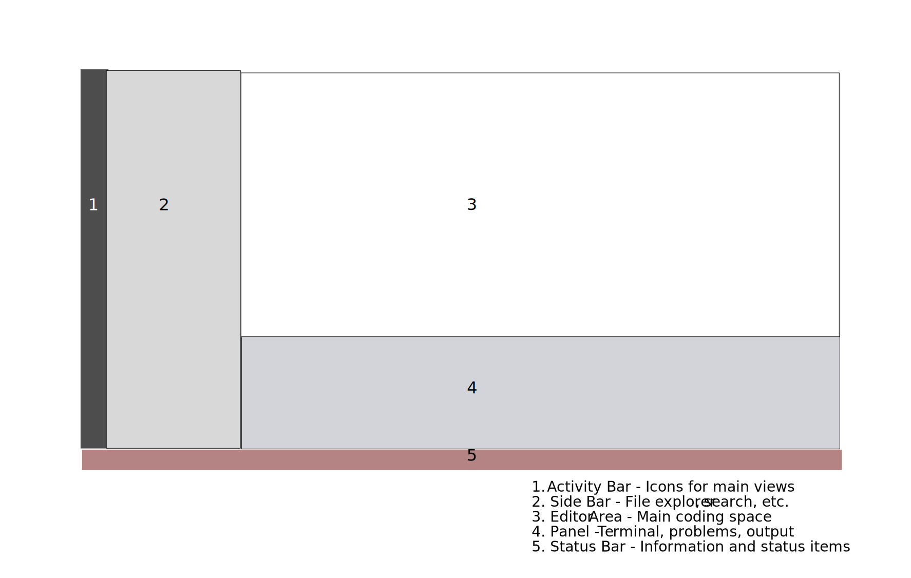

<div class="tutorial-container">

# Working with Text Editors

Visual Studio Code (VS Code) is a powerful editor that makes web development easier and more efficient.

::: highlight-box
In this tutorial, you'll learn:

- Essential VS Code features
- Helpful extensions
- Keyboard shortcuts
- Code organization tips
  :::

## VS Code Interface



### Key Areas

1. **File Explorer**: Browse and manage files
2. **Editor Area**: Write and edit code
3. **Activity Bar**: Switch between views
4. **Status Bar**: Information and settings
5. **Integrated Terminal**: Run commands

## Essential Features

### 1. IntelliSense

- Auto-completion
- Syntax highlighting
- Error detection
- Quick fixes

### 2. Multi-cursor Editing

- Hold Alt/Option + Click for multiple cursors
- Select similar words with Ctrl/Cmd + D
- Edit multiple lines simultaneously

### 3. Integrated Terminal

- Open: Ctrl + ` (backtick)
- Run commands
- View output
- Multiple terminals

## Must-Have Extensions

### 1. Live Server

- Real-time preview
- Auto-refresh
- Local development server

### 2. HTML CSS Support

- Better HTML/CSS editing
- Class suggestions
- Color previews

### 3. Auto Rename Tag

- Automatically rename paired HTML tags
- Faster editing
- Fewer errors

## Keyboard Shortcuts

::: highlight-box
**Essential Shortcuts**

- Save: Ctrl/Cmd + S
- Find: Ctrl/Cmd + F
- Replace: Ctrl/Cmd + H
- Toggle Terminal: Ctrl + `
- Format Document: Alt + Shift + F
  :::

## File Organization

### Workspace Setup

```
project-name/
├── index.html
├── css/
│   └── style.css
├── js/
│   └── script.js
└── images/
    └── logo.png
```

### Using the File Explorer

1. Create new files/folders
2. Drag and drop
3. Context menu options
4. Search files

## Code Snippets

VS Code includes helpful snippets for quick coding:

1. HTML Boilerplate

   - Type `!` or `html:5`
   - Press Tab

2. CSS Properties

   - Type property name
   - Choose from suggestions

3. Custom Snippets
   - File > Preferences > User Snippets
   - Create your own

## Settings and Customization

### Theme Selection

1. Ctrl/Cmd + K, Ctrl/Cmd + T
2. Choose from many themes
3. Install additional themes

### User Settings

1. File > Preferences > Settings
2. Search for options
3. Customize editor behavior

## Practice Exercises

::: highlight-box
Try these tasks:

1. Create a new project folder
2. Set up basic file structure
3. Use multiple cursors
4. Create a custom snippet
5. Install and test extensions
   :::

## Troubleshooting

Common issues and solutions:

1. **Live Server Not Working**

   - Check port availability
   - Reinstall extension
   - Verify file paths

2. **Extensions Not Loading**

   - Reload VS Code
   - Check compatibility
   - Update extensions

3. **Performance Issues**
   - Disable unused extensions
   - Clear editor cache
   - Update VS Code

## Best Practices

1. **Regular Saving**

   - Use Auto Save
   - Ctrl/Cmd + S habit

2. **File Naming**

   - Use lowercase
   - No spaces
   - Descriptive names

3. **Code Formatting**
   - Use formatter
   - Consistent style
   - Regular formatting

## Emmet Abbreviations

VS Code includes Emmet, a powerful tool that speeds up HTML and CSS writing.

### Basic HTML Shortcuts

1. **HTML Template**

   ```html
   ! + Tab
   ```

   Creates complete HTML5 boilerplate

2. **Elements with Classes**

   ```html
   div.container + Tab
   ```

   Creates `<div class="container"></div>`

3. **Multiple Elements**
   ```html
   ul>li*3 + Tab
   ```
   Creates:
   ```html
   <ul>
   	<li></li>
   	<li></li>
   	<li></li>
   </ul>
   ```

::: highlight-box
**Common Emmet Patterns**

- `p{text}` → `<p>text</p>`
- `div>p` → `<div><p></p></div>`
- `h1+p` → `<h1></h1><p></p>`
- `.item` → `<div class="item"></div>`
  :::

### CSS Shortcuts

- `m10` → `margin: 10px;`
- `p20` → `padding: 20px;`
- `df` → `display: flex;`

::: tip
We'll cover more advanced Emmet features in the HTML and CSS tutorials. For now, try these basic shortcuts to speed up your coding!
:::

## What's Next?

Now that you're comfortable with VS Code, let's learn about browser developer tools.

</div>
