<div class="tutorial-container">

# Browser Developer Tools

Chrome DevTools is a powerful set of web development tools built directly into the browser. These tools help you inspect, debug, and optimize your websites.

::: highlight-box
In this tutorial, you'll learn:

- How to open and use DevTools
- Inspect and modify HTML/CSS
- Debug JavaScript
- Analyze page performance
  :::

## Opening DevTools

There are several ways to open Chrome DevTools:

- Press `F12` on Windows/Linux
- Press `Cmd + Option + I` on Mac
- Right-click and select "Inspect"
- Use Chrome menu → More Tools → Developer Tools



## Elements Panel

The Elements panel shows your page's HTML and CSS.

### Inspecting Elements

1. Click the inspect icon <i class="fa-solid fa-location-crosshairs"></i>
2. Hover over page elements
3. Click to select an element

### Modifying HTML

- Double-click text to edit
- Right-click elements for more options
- Drag elements to reorder

### Styles Pane

- View applied CSS
- Toggle properties
- Add new styles
- See computed values

::: highlight-box
**Practice**: Try these steps:

1. Inspect this page
2. Find this box's HTML
3. Look at its CSS styles
   :::

## Console Panel

The Console is your JavaScript playground and debugging tool.

### Basic Usage

- View JavaScript errors
- Log messages
- Test code snippets
- Interact with the page

### Common Commands

```javascript
console.log('Hello'); // Basic logging
console.error('Oops!'); // Error message
console.table(data); // Display data in table
```

## Network Panel

Monitor network requests and performance.

### Key Features

1. **Request List**

   - Files loaded
   - Loading time
   - File size

2. **Timeline**

   - When requests started
   - Download duration
   - Dependencies

3. **Headers**
   - Request details
   - Response data
   - Cookie information

## Application Panel

Inspect storage and PWA features.

### Storage Options

- Local Storage
- Session Storage
- Cookies
- Cache
- Web SQL

## Device Toolbar

Test responsive design and mobile views.

### Features

1. **Responsive Mode**

   - Resize viewport
   - Set device dimensions
   - Test breakpoints

2. **Device Simulation**
   - Choose device presets
   - Test orientation
   - Set pixel ratio

## Performance Tools

Analyze and optimize website performance.

### Key Metrics

- Loading time
- JavaScript execution
- Layout changes
- Memory usage

## Common Tasks

### 1. Debug CSS

1. Select element
2. Check Styles panel
3. Toggle properties
4. Test changes live

### 2. Find JavaScript Errors

1. Open Console
2. Look for red errors
3. Click for details
4. Fix in code

### 3. Test Responsiveness

1. Open Device Toolbar
2. Choose device/size
3. Test interactions
4. Check layouts

## Best Practices

::: highlight-box
**Developer Tips**

1. Keep DevTools open while coding
2. Use Console for quick tests
3. Save useful code snippets
4. Learn keyboard shortcuts
   :::

## Keyboard Shortcuts

### Windows/Linux

- `Ctrl + Shift + I`: Open DevTools
- `Ctrl + Shift + C`: Inspect element
- `Ctrl + Shift + J`: Open Console
- `Ctrl + Shift + M`: Toggle device toolbar

### Mac

- `Cmd + Option + I`: Open DevTools
- `Cmd + Option + C`: Inspect element
- `Cmd + Option + J`: Open Console
- `Cmd + Option + M`: Toggle device toolbar

## Practice Exercises

1. **Element Inspection**

   - Inspect this page's header
   - Find its CSS properties
   - Try modifying styles

2. **Console Practice**

   - Open the console
   - Try some console.log commands
   - Check for any errors

3. **Network Analysis**
   - Open Network panel
   - Reload the page
   - Examine request timing

::: tip Real-World Application
As you build projects, use DevTools to:

- Debug layout issues
- Test responsive design
- Optimize performance
- Fix JavaScript errors
  :::

## What's Next?

Now that you're familiar with your development tools, you're ready to start building websites! Continue to our HTML tutorials to begin creating web pages.

</div>
